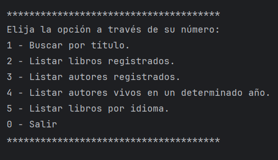

# Biblioteca Virtual

## 📚 Resumen

Esta es una herramienta de línea de comandos escrita en **Java 17**, diseñada para explorar y buscar información sobre libros y autores. La aplicación utiliza la API de [Gutendex](https://gutendex.com/) para acceder a datos sobre obras literarias y emplea **PostgreSQL 15.3** como base de datos. Además, el proyecto es fácilmente gestionable a través de **Docker Compose**.

## 🛠️ Requisitos

Antes de comenzar, asegúrate de tener instalados los siguientes elementos:

- **Java 17** o superior.
- **Docker** para la ejecución de contenedores.

## 🚀 Instalación y Configuración

1. **Clona este repositorio** en tu máquina local:
    ```bash
    git clone https://github.com/Alunizar23/literatura.git
    cd literatura
    ```

2. **Configura Docker**:
    - Verifica que Docker y Docker Compose estén instalados correctamente en tu sistema.
    - Utiliza el archivo `docker-compose.yml` para iniciar los servicios necesarios ejecutando:
        ```bash
        docker-compose up -d
        ```

3. **Inicia la aplicación**:
    - La aplicación ya estará lista para conectarse a la base de datos y realizar búsquedas.

4. **Para detener los servicios**:
    - Cuando termines, detén y elimina los contenedores con:
        ```bash
        docker-compose down
        ```

## 🧑‍💻 Cómo Usar

Una vez configurada, puedes buscar información sobre libros y autores con base en:

- **Nombres de autores**.
- **Categorías** como géneros literarios.
- **Años de publicación**.

### Ejemplo de Uso
1. **Selecciona una búsqueda**:
    - La aplicación te pedirá elegir un criterio (autor, categoría o año).
2. **Introduce los datos**:
    - Ingresa el término que deseas buscar. Por ejemplo:
        - Autor: "William Shakespeare"
        - Categoría: "Ficción"
        - Año: "1850"
3. **Consulta los resultados**:
    - La aplicación mostrará una lista de libros que coincidan con los criterios ingresados.



## 🔄 Funciones Clave

- **Búsqueda dinámica**: Filtra resultados en función de varios parámetros.
- **Almacenamiento seguro**: Utiliza una base de datos para almacenar y recuperar información rápidamente.
- **Compatibilidad multiplataforma**: Puede ejecutarse en cualquier sistema que soporte Docker.

## 📦 Gestión de Contenedores

- **Iniciar los servicios**:
    ```bash
    docker-compose up -d
    ```
- **Finalizar los servicios**:
    ```bash
    docker-compose down
    ```

## 🛡️ Licencia

Este proyecto está licenciado bajo la **MIT License**. Consulta el archivo [LICENSE](LICENSE) para obtener más detalles.

---

¡Explora la literatura con solo unos comandos!
